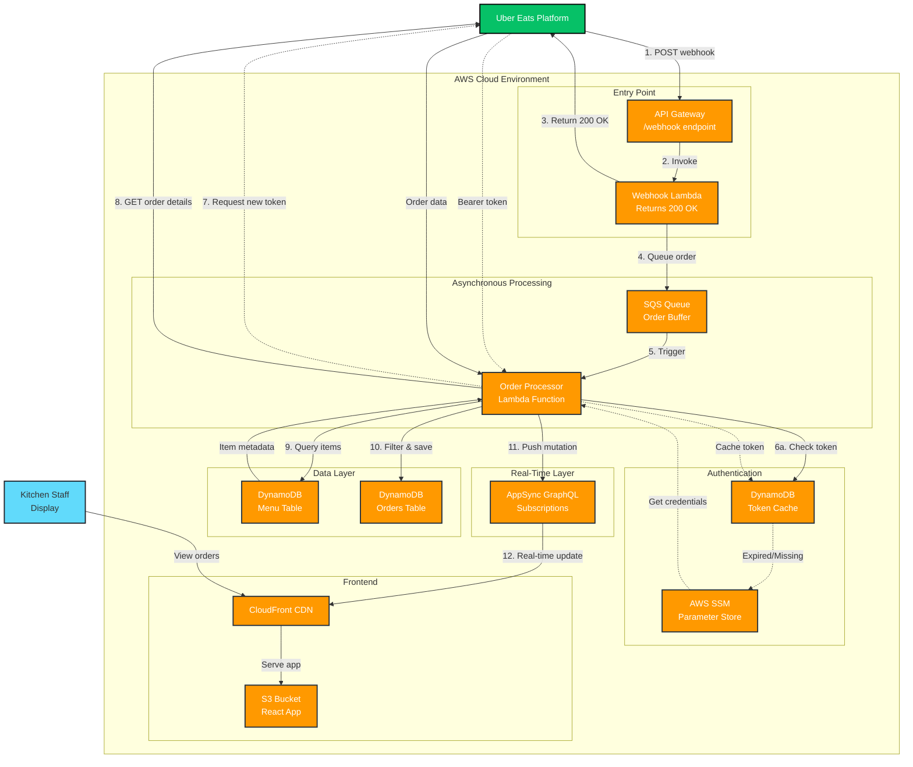
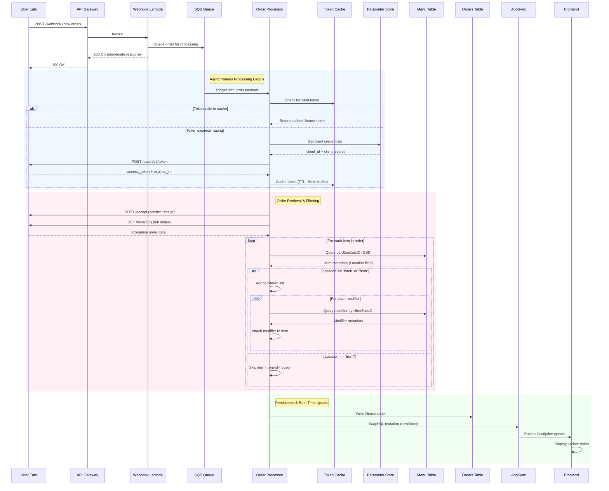

# PrepDeck – Kitchen Display System for Uber Eats

A serverless, real-time kitchen display system that automatically processes Uber Eats orders and filters them to show only back-of-house items that require kitchen preparation.

---

## 🏗 Architecture Overview

PrepDeck uses an event-driven, asynchronous architecture with intelligent filtering to separate front-of-house (drinks, packaged items) from back-of-house (kitchen-prepared items) orders.



### Technology Stack

**Frontend**
- **Framework:** React with TypeScript
- **Styling:** Tailwind CSS
- **Build Tool:** Vite
- **Hosting:** Amazon S3 (static hosting)
- **CDN:** Amazon CloudFront (global caching)

**Backend**
- **API:** Amazon API Gateway (REST webhook endpoint)
- **Compute:** AWS Lambda (Python 3.11)
  - `WebhookHandler` - Receives Uber webhooks
  - `OrderProcessor` - Processes and filters orders
- **Message Queue:** Amazon SQS (decouples webhook from processing)
- **Real-Time:** AWS AppSync (GraphQL subscriptions)
- **Authentication:** OAuth 2.0 Bearer tokens (cached)

**Data**
- **Database:** Amazon DynamoDB
  - `Menu` table - Item catalog with location metadata (front/back/both)
  - `Orders` table - Filtered order records
  - `TokenCache` table - OAuth token storage
- **Secrets:** AWS Systems Manager Parameter Store (encrypted credentials)

**DevOps**
- **Infrastructure as Code:** Terraform
- **CI/CD:** GitHub Actions

---

## 🔄 Order Processing Flow

PrepDeck uses a multi-stage asynchronous pipeline to ensure fast webhook responses while performing intelligent order filtering in the background.



### Step-by-Step Breakdown

#### **Stage 1: Webhook Ingestion (Synchronous)**
1. **Uber Eats** sends a POST request to API Gateway `/webhook` endpoint
2. **Webhook Lambda** is invoked immediately
3. Lambda pushes the raw payload to **SQS Queue**
4. Lambda returns **200 OK** to Uber Eats (< 3 seconds)
   - *This prevents Uber from retrying due to timeout*

#### **Stage 2: Token Management (Cached)**
5. **Order Processor Lambda** is triggered by SQS message
6. Checks **DynamoDB Token Cache** for valid Bearer token
   - If valid token exists (and not expiring in < 5 minutes): use it
   - If expired or missing:
     - Retrieve `client_id` and `client_secret` from **AWS SSM Parameter Store**
     - Request new token from Uber's OAuth endpoint (`/oauth/v2/token`)
     - Cache token with TTL (`expires_in - 300 seconds`)

#### **Stage 3: Order Acceptance & Retrieval**
7. Send **POST /accept** to Uber Eats API to confirm order receipt
8. Send **GET /order/{id}** using the `resource_href` from webhook payload
9. Receive complete order details including:
   - Customer info
   - Cart items with modifiers
   - Special instructions
   - Current state

#### **Stage 4: Intelligent Filtering**
10. For each item in the order:
    - Query **Menu Table** using `UberEatsID-index` (GSI)
    - Check `Location` field:
      - `"back"` → Kitchen-prepared item (e.g., sushi rolls)
      - `"front"` → Pre-packaged item (e.g., drinks) → **SKIP**
      - `"both"` → Hybrid item → **INCLUDE**
11. For each included item:
    - Extract all **modifiers** from `selected_modifier_groups`
    - Query Menu Table for each modifier to get Mandarin names
    - Build enriched item object with:
      - Mandarin title (`name_mandarin`)
      - Internal SKU
      - Quantity
      - Special instructions
      - Attached modifiers

#### **Stage 5: Persistence & Real-Time Push**
12. Save filtered order to **Orders Table** in DynamoDB
13. Send GraphQL mutation to **AppSync**:
    ```graphql
    mutation NewOrder($order: OrderInput!) {
      newOrder(order: $order) {
        OrderID
        DisplayID
        State
        Items
        SpecialInstructions
      }
    }
    ```
14. AppSync broadcasts to all subscribed frontend clients
15. Kitchen display updates in **real-time** with new ticket

---

## 🗄 Database Schema

### Menu Table
```json
{
  "ItemID": "ITEM_001",              // Primary Key
  "UberEatsID": "abc-123",            // GSI Key (for reverse lookup)
  "ItemName": "California Roll",
  "name_mandarin": "加州卷",
  "Location": "back",                 // "front" | "back" | "both"
  "Price": 8.99,
  "Category": "Rolls"
}
```

**Global Secondary Index:** `UberEatsID-index`
- Used to map Uber Eats item IDs to internal menu items

### Orders Table
```json
{
  "OrderID": "uber-order-12345",     // Primary Key
  "DisplayID": "#1234",               // Customer-facing order number
  "State": "pos_processing",
  "Items": [
    {
      "Title": "加州卷",
      "InternalSKU": "ITEM_001",
      "Quantity": 2,
      "SpecialInstructions": "No avocado",
      "Modifiers": [
        {
          "Title": "加辣酱",
          "InternalSKU": "MOD_SPICY",
          "Quantity": 1
        }
      ]
    }
  ],
  "SpecialInstructions": "Contact-free delivery"
}
```

### Token Cache Table
```json
{
  "ProviderName": "UberEats",        // Primary Key
  "AccessToken": "eyJhbGc...",
  "ExpiresAt": 1700000000             // Unix timestamp (with 5min buffer)
}
```

---

## 🔐 Authentication & Security

### Uber Eats OAuth Flow
- **Grant Type:** `client_credentials`
- **Scopes:** `eats.order eats.store`
- **Token Caching:** DynamoDB with TTL to minimize API calls
- **Credential Storage:** AWS Systems Manager Parameter Store (encrypted)

### AWS IAM Permissions
- Lambda execution role has permissions for:
  - DynamoDB read/write (Menu, Orders, TokenCache tables)
  - SSM Parameter Store read (Uber credentials)
  - AppSync mutation execution (real-time updates)
  - SQS message consumption

### AppSync Authorization
- **API Key** for public subscriptions (kitchen displays)
- **IAM** for Lambda function mutations
- **SigV4 signing** for secure GraphQL requests

---

## 📋 Key Features

✅ **Asynchronous Processing** – Webhook responds in < 3 seconds, preventing Uber retries  
✅ **Intelligent Filtering** – Only back-of-house items appear on kitchen displays  
✅ **Multi-Language Support** – Shows Mandarin names for kitchen staff  
✅ **Modifier Tracking** – Captures all customizations (sauces, toppings, etc.)  
✅ **Token Caching** – Reduces OAuth API calls by 95%+  
✅ **Real-Time Updates** – Orders appear instantly via AppSync subscriptions  
✅ **Fault Tolerant** – SQS retry logic handles transient failures  
✅ **Serverless Scalability** – Auto-scales from 0 to thousands of orders

---

## 🚀 Deployment

### Prerequisites
- AWS Account with appropriate permissions
- Terraform >= 1.5.0
- Node.js >= 18.x
- Uber Eats API credentials

### Infrastructure Deployment
```bash
# Clone repository
git clone https://github.com/your-org/prepdeck.git
cd prepdeck

# Initialize Terraform
cd infrastructure
terraform init

# Configure variables (create terraform.tfvars)
cat > terraform.tfvars <<EOF
uber_client_id     = "your-client-id"
uber_client_secret = "your-client-secret"
aws_region         = "us-east-1"
EOF

# Deploy infrastructure
terraform plan
terraform apply
```

### Frontend Deployment
```bash
# Install dependencies
cd frontend
npm install

# Build for production
npm run build

# Deploy to S3
aws s3 sync dist/ s3://prepdeck-frontend-bucket --delete

# Invalidate CloudFront cache
aws cloudfront create-invalidation \
  --distribution-id E1234567890ABC \
  --paths "/*"
```

### CI/CD Pipeline
GitHub Actions automatically:
- Runs Terraform validation on PRs
- Deploys infrastructure on merge to `main`
- Builds and deploys frontend to S3
- Invalidates CloudFront cache

---

## 🧪 Testing

### Local Lambda Testing
```bash
# Install AWS SAM CLI
brew install aws-sam-cli

# Invoke function locally
sam local invoke OrderProcessor \
  --event test-events/uber-webhook.json
```

### Uber Eats Webhook Testing
1. Navigate to [Uber Developer Dashboard](https://developer.uber.com/)
2. Go to **Webhooks** → **Test Event**
3. Send test order to your `/webhook` endpoint
4. Verify:
   - CloudWatch logs show successful processing
   - Order appears in DynamoDB Orders table
   - Kitchen display updates in real-time

### Sample Test Payload
```json
{
  "event_id": "evt-test-123",
  "event_type": "orders.notification",
  "event_time": "2025-11-18T10:30:00Z",
  "resource_href": "https://api.uber.com/v1/eats/order/uber-order-12345"
}
```

---

## 🛠 Future Enhancements

### Phase 2: Order State Management
- ✅ Mark orders as "In Progress"
- ✅ Mark orders as "Ready for Pickup"
- ✅ Sync state back to Uber Eats API

### Phase 3: Analytics Dashboard
- 📊 Average preparation time by item
- 📈 Peak order volume tracking
- 🔥 Most popular items and modifiers

### Phase 4: Multi-Platform Support
- 🚀 DoorDash integration
- 🚀 Grubhub integration
- 🚀 Unified kitchen display for all platforms

### Phase 5: Kitchen Optimization
- ⏱️ Estimated prep time per order
- 🔔 Audio alerts for new orders
- 📱 Mobile app for kitchen staff

---

## 📞 Support

For issues or questions:
- **GitHub Issues:** [github.com/your-org/prepdeck/issues](https://github.com/your-org/prepdeck/issues)
- **Documentation:** [docs.prepdeck.io](https://docs.prepdeck.io)

---

## 📄 License

MIT License - See [LICENSE](LICENSE) file for details
