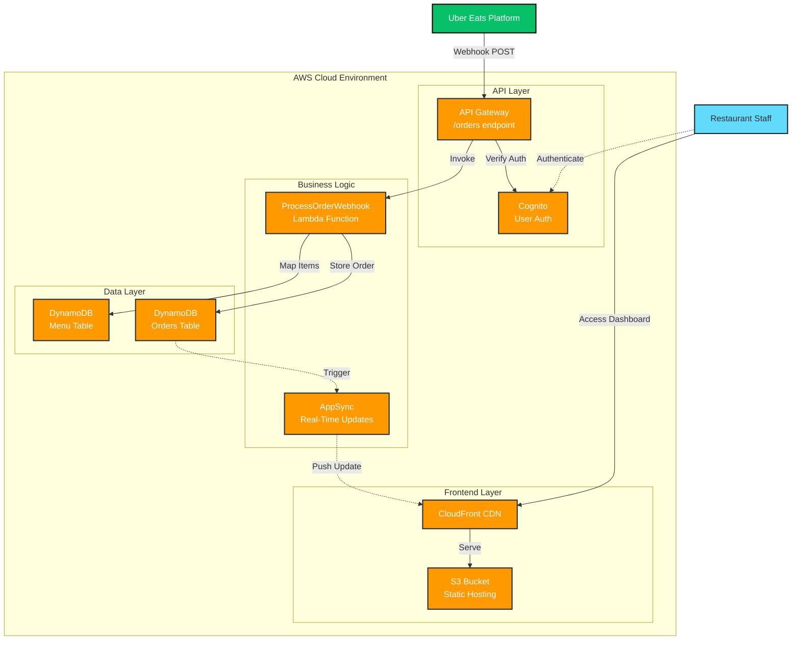
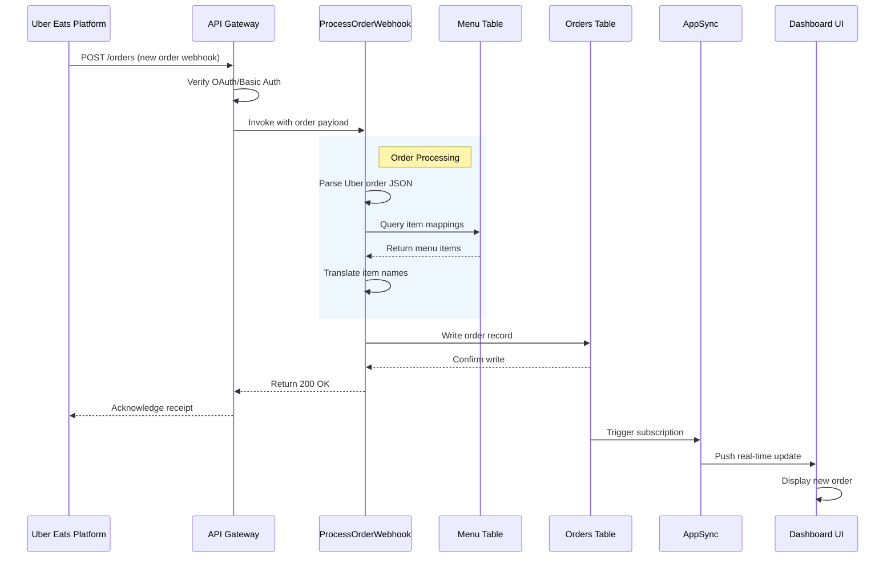

# Momotaro Dashboard – Uber Eats Integration

A serverless restaurant management dashboard that seamlessly integrates with Uber Eats to provide real-time order monitoring and fulfillment capabilities.

---

## 🏗 Architecture Overview

This application follows a modern serverless architecture pattern, leveraging AWS services for scalability, reliability, and cost-efficiency.



### Technology Stack

**Frontend**
- **Framework:** React with TypeScript
- **Hosting:** Amazon S3 (static hosting)
- **CDN:** Amazon CloudFront (global distribution)

**Backend**
- **API:** Amazon API Gateway (REST)
- **Compute:** AWS Lambda (Node.js/Python)
- **Real-Time:** AWS AppSync (GraphQL subscriptions)
- **Authentication:** Amazon Cognito

**Data**
- **Database:** Amazon DynamoDB
  - `Menu` table (item catalog)
  - `Orders` table (order records)

**DevOps**
- **Infrastructure as Code:** Terraform
- **CI/CD:** GitHub Actions

---

## 🔗 Uber Eats Integration

The dashboard receives orders through Uber Eats webhooks and processes them in real-time.



### Uber Eats API Functions

| Function | Purpose | Implementation |
|----------|---------|----------------|
| **AcceptOrder** | Confirm receipt of an order | Called by Lambda after successful DB write |
| **GetOrder** | Retrieve full order details | Used for order verification and updates |
| **WebhookEvents** | Receive new order notifications | POST endpoint exposed via API Gateway |

---

## 🚀 Implementation Guide

### 1. Database Schema

**Orders Table**
- **Primary Key:** `OrderID` (String)
- **Attributes:**
  - `OrderID` – Uber Eats order identifier
  - `Items` – Array of ordered items (translated)
  - `CustomerName` – Customer details
  - `Status` – Order fulfillment status
  - `Timestamp` – Order creation time
  - `TotalAmount` – Order total
  - `UberPayload` – Raw Uber Eats data (for debugging)

**Menu Table**
- **Primary Key:** `ItemID` (String)
- **Attributes:**
  - `ItemID` – Internal item identifier
  - `UberEatsName` – Name as it appears in Uber Eats
  - `DisplayName` – Name shown in dashboard
  - `Price` – Item price
  - `Category` – Item category

### 2. Webhook Configuration

**API Gateway Setup**
```
POST /orders
├── Integration: Lambda Function (ProcessOrderWebhook)
├── Authorization: Cognito User Pool OR Custom (OAuth/Basic Auth)
└── Response: 200 OK (acknowledgment to Uber Eats)
```

**Lambda Function Flow**
1. **Receive:** Parse incoming Uber Eats webhook payload
2. **Authenticate:** Verify OAuth token or Basic Auth credentials
3. **Map:** Query Menu table to translate Uber item names to internal names
4. **Validate:** Ensure all items exist in the menu
5. **Store:** Write order record to Orders table
6. **Acknowledge:** Return 200 OK to Uber Eats
7. **Notify:** Trigger AppSync subscription for real-time dashboard update

### 3. Authentication

The system supports multiple authentication methods:

**For Dashboard Users (Restaurant Staff)**
- Amazon Cognito User Pools
- Username/password or federated login

**For Uber Eats Webhooks**
- **OAuth 2.0:** Bearer token validation (preferred)
- **Basic Auth:** Username/password header validation (fallback)

Credentials are verified at both API Gateway and Lambda layers for defense in depth.

### 4. Testing

**Development Testing**
1. Navigate to [Uber Eats Developer Dashboard](https://developer.uber.com/)
2. Configure a test webhook event with sample order data
3. Send test event to your `/orders` endpoint
4. Verify the following:
   - API Gateway receives request (check CloudWatch logs)
   - Lambda processes order successfully (check Lambda logs)
   - Order appears in DynamoDB Orders table
   - Dashboard updates in real-time (AppSync subscription)

**Test Payload Example**
```json
{
  "event_id": "test-12345",
  "event_type": "orders.notification",
  "event_time": "2025-11-18T10:30:00Z",
  "order": {
    "id": "uber-order-12345",
    "items": [
      {
        "name": "California Roll",
        "quantity": 2,
        "price": 8.99
      }
    ],
    "customer": {
      "name": "John Doe"
    }
  }
}
```

---

## 📋 Features

- ✅ **Real-Time Order Updates** – New orders appear instantly via AppSync subscriptions
- ✅ **Item Name Translation** – Maps Uber Eats item names to internal menu terminology
- ✅ **Secure Authentication** – Multi-layer auth for both staff and webhook endpoints
- ✅ **Serverless Scalability** – Automatically handles traffic spikes with zero server management
- ✅ **Infrastructure as Code** – Entire stack deployed and versioned via Terraform
- ✅ **Audit Trail** – Raw Uber Eats payloads stored for debugging and compliance

---

## 🔧 Deployment

```bash
# Install dependencies
npm install

# Initialize Terraform
terraform init

# Plan infrastructure changes
terraform plan

# Deploy to AWS
terraform apply

# Deploy frontend
npm run build
aws s3 sync build/ s3://momotaro-dashboard-bucket
aws cloudfront create-invalidation --distribution-id <ID> --paths "/*"
```

**GitHub Actions CI/CD**
- Automatic testing on pull requests
- Infrastructure validation via `terraform plan`
- Automated deployment to production on merge to `main`

---

## 🛠 Future Enhancements

- **Order Status Management** – Allow staff to mark orders as prepared/delivered
- **Analytics Dashboard** – Track order volume, peak hours, and popular items
- **Multi-Platform Support** – Integrate DoorDash, Grubhub, and other delivery platforms
- **Kitchen Display System (KDS)** – Dedicated interface for kitchen staff
- **Inventory Tracking** – Sync menu availability with inventory levels
